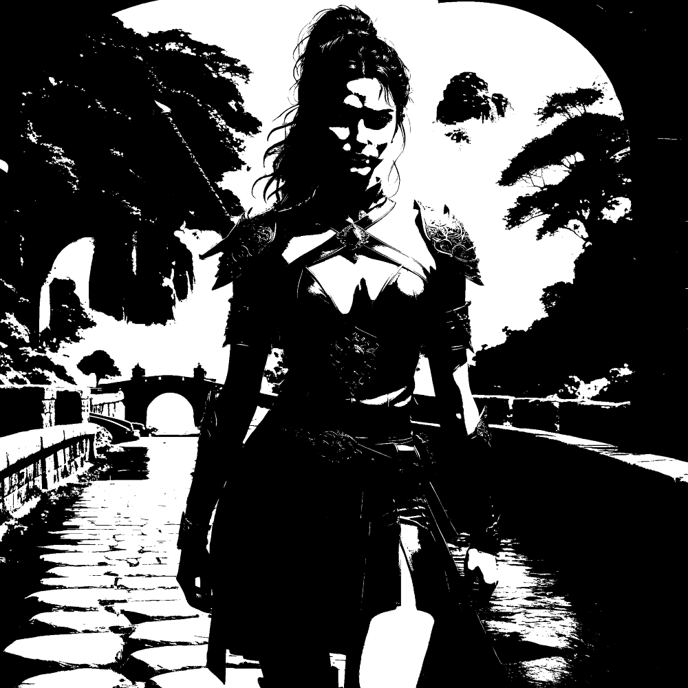
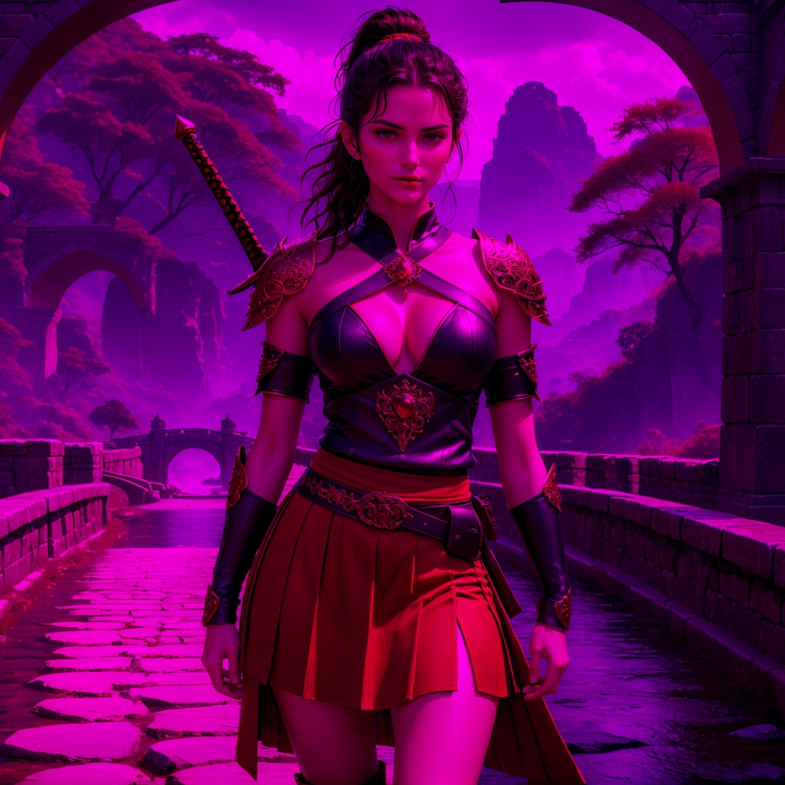
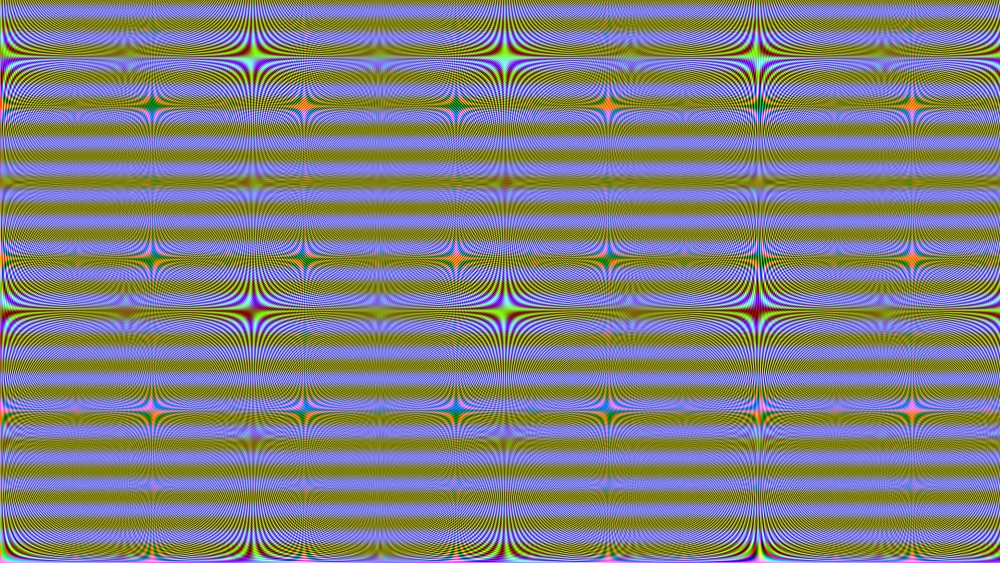
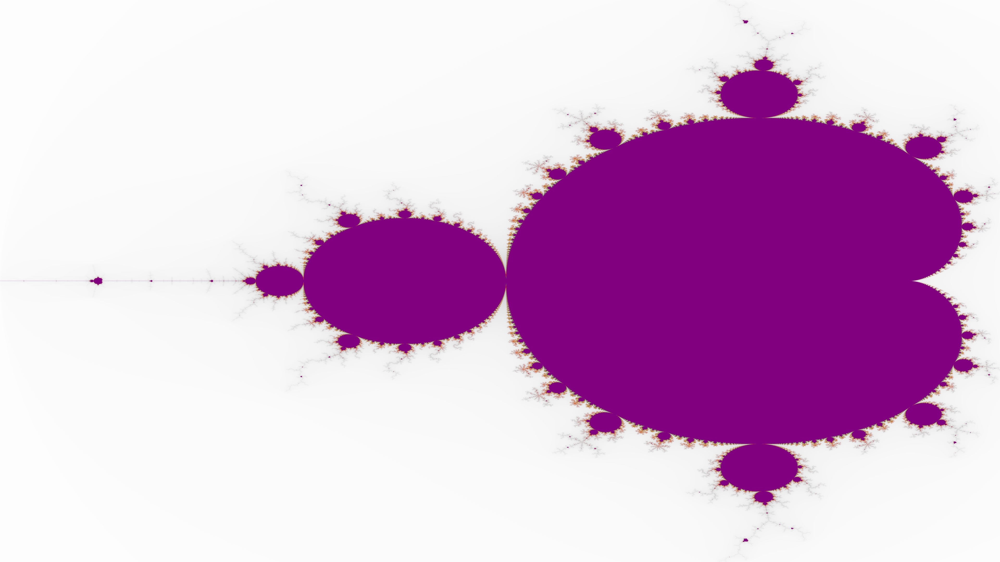

### _Usage:_
--------

Only the class `canvas` provides predefined image transformations routines. Other classes (`bitmap`, `png` & `ico`) suport reading, encoding,
parsing, decoding and serializing their respective file formats. These classes do provide a converting constructor to class `canvas` which
can be used to manipulate these images (internally, the converting constructor will create a `bitmap` from these types which is the base class for class `canvas`).

```C++
#include <canvas> // a class that uses the bitmap class as base
// below we read in the bitmap from disk as a canvas object
canvas image {LR"(./image.bmp)"};
```


---------

```C++
// .copy() returns a deep copy so that the original stays as is during the transformation
image.copy(). // specify a preferred RGB to black and white mapping method
to_blacknwhite<rgb::BW_TRANSFORMATION::AVERAGE>().to_file(LR"(./average.bmp)");
```


```C++
image.copy().to_blacknwhite<rgb::BW_TRANSFORMATION::WEIGHTED_AVERAGE>().
to_file(LR"(./weighted_average.bmp)");
```


```C++
image.copy().to_blacknwhite<rgb::BW_TRANSFORMATION::BINARY>().to_file(LR"(./binary.bmp)");
```



```C++
image.copy().to_blacknwhite<rgb::BW_TRANSFORMATION::LUMINOSITY>().to_file(LR"(./luminosity.bmp)");
```


---------

```C++
image.copy().remove_colour<rgb::RGB_TAG::BLUE>().to_file(LR"(.\redgreen.bmp)"); // remove blue
```


```C++
// remove red & blue
image.copy().remove_colour<rgb::RGB_TAG::REDBLUE>().to_file(LR"(.\green.bmp)");
```


```C++
image.copy().remove_colour<rgb::RGB_TAG::RED>().to_file(LR"(.\bluegreen.bmp)"); // remove red
```


```C++
// remove red & green
image.copy().remove_colour<rgb::RGB_TAG::REDGREEN>().to_file(LR"(.\blue.bmp)");
```


```C++
image.copy().remove_colour<rgb::RGB_TAG::GREEN>().to_file(LR"(.\redblue.bmp)"); // remove green
```




```C++
// remove green & blue
image.copy().remove_colour<rgb::RGB_TAG::GREENBLUE>().to_file(LR"(.\red.bmp)");
```


---------

```C++
std::mt19937_64 reng { static_cast<unsigned long long>(std::chrono::high_resolution_clock::now().
                       time_since_epoch().count()) };
canvas rectangle {1920 /* width */, 1080 /* height */};
board.fill(RGBQUAD { static_cast<unsigned char>(reng() % std::numeric_limits<unsigned char>::max()) /* B */,
                     static_cast<unsigned char>(reng() % std::numeric_limits<unsigned char>::max()) /* G */,
                     static_cast<unsigned char>(reng() % std::numeric_limits<unsigned char>::max()) /* R */,
                     0XFF });
rectangle.to_file(LR"(colour.bmp)");
```


---------

```C++
canvas rectangle {1920, 1080 };
rectangle.waves();
rectangle.to_file(LR"(waves.bmp)");
```



```C++
canvas board { 8640, 15360 };
board.mandelbrot(colourmaps::VGA);  // choose a colourmap of your liking, provided by <cmaps>
board.to_file(LR"(./mandelbrot.bmp)");
```




---------

### _Warning:_
--------

Owing to the non-opt-in use of `SSSE3`, `AVX2` and `AVX512` compiler (`MSVC` & `LLVM`) intrinsics, If compiles, will probably raise an illegal instruction hardware exception at runtime on unsupported CPU architectures (anything other than `AMD64`). Unfortunately my expertise is very Windows centric hence, I have no desire to accommodate the `linux/g++` toolchain in this project.

### _Reference:_
--------

Compressed Image File Formats: JPEG, PNG, GIF, XBM, BMP - John Miano (1999) ACM Press/Addison-Wesley Publishing Co.
