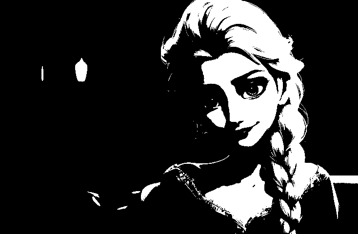

# ___BMP___

__Original__


```C
ToBWhite(&image, LUMINOSITY, false);
```


```C
ToBWhite(&image, AVERAGE, false);
```


```C
ToBWhite(&image, WEIGHTED_AVERAGE, false);
```


```C
ToBWhite(&image, BINARY, false);
```



```C
RemoveColour(&image, RED, false);
```


```C
RemoveColour(&image, BLUE, false);
```


```C
RemoveColour(&image, GREEN, false);
```


```C
RemoveColour(&image, GREENBLUE, false);
```


```C
RemoveColour(&image, REDBLUE, false);
```


```C
RemoveColour(&image, REDGREEN, false);
```


----------------
___References:___

- `Compressed Image File Formats: JPEG, PNG, GIF, XBM, BMP - John Miano (1999) ACM Press/Addison-Wesley Publishing Co`.

- `PNG: The Definitive Guide. - Greg Roelofs and Richard Koman. (1999) O'Reilly Associates, Inc., USA`.

- `The Data Compression Book, Second Edition, Mark Nelson and Jean-Loop Gailly. 1995. M&T Books, New York, NY`

- https://koushtav.me/jpeg/tutorial/2017/11/25/lets-write-a-simple-jpeg-library-part-1/

- https://koushtav.me/jpeg/tutorial/c++/decoder/2019/03/02/lets-write-a-simple-jpeg-library-part-2/

----------------
