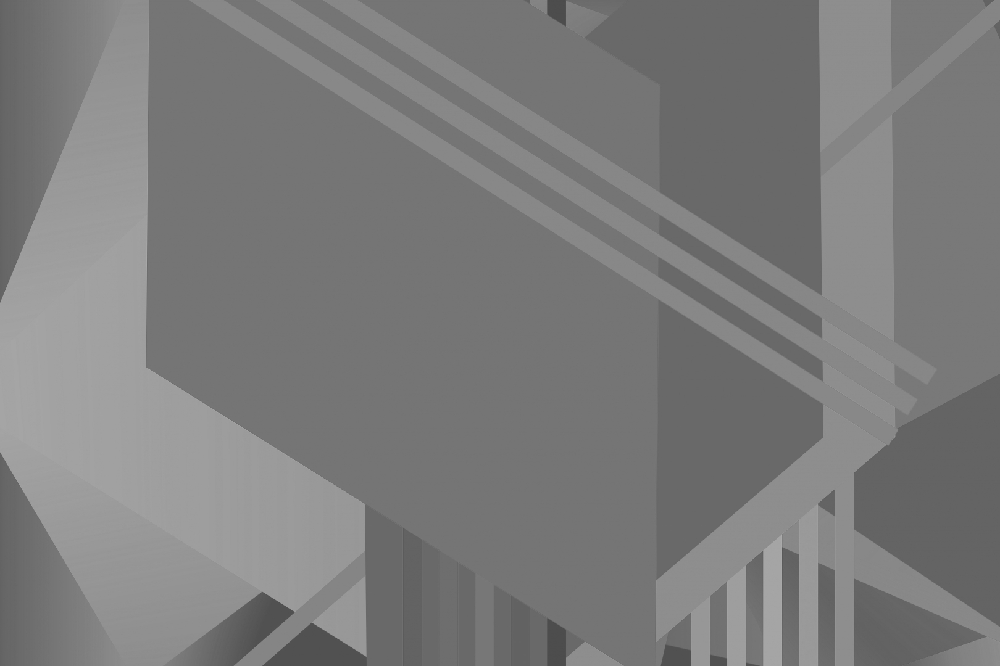

Caution: `Images in this README.md are JPEG converts of the bitmap files used in and resulted from the image manipulations. This was done to minimize the repository size!`

### _Usage:_
---------

Only the class `canvas` provides predefined image transformations routines. Other classes (`bitmap` & `ico`) support reading, parsing and serializing their respective file formats. These classes do provide a converting constructor to class `canvas` which
can be used to manipulate these images (internally, the converting constructor will create a `bitmap` from these types which is the base class for `canvas`).

---------
```C++
#include <canvas> // a class that uses the class bitmap as base
// read in a bitmap from disk as a canvas object
canvas image {LR"(./image.bmp)"};
```


---------
```C++
// .copy() returns a deep copy so that the original stays as is during the transformation
// specify a preferred RGB to black and white mapping method
image.copy().to_blacknwhite<rgb::BW_TRANSFORMATION::AVERAGE>().to_file(LR"(./average.bmp)");
image.copy().to_blacknwhite<rgb::BW_TRANSFORMATION::WEIGHTED_AVERAGE>().to_file(LR"(./weighted_average.bmp)");

```
<div>
    
    
</div>

---------
```C++
image.copy().to_blacknwhite<rgb::BW_TRANSFORMATION::LUMINOSITY>().to_file(LR"(./luminosity.bmp)");
image.copy().to_blacknwhite<rgb::BW_TRANSFORMATION::BINARY>().to_file(LR"(./binary.bmp)");
```
<div>
    
    
</div>

---------
```C++
image.copy().remove_colour<rgb::RGB_TAG::BLUE>().to_file(LR"(.\redgreen.bmp)"); // remove blue
image.copy().remove_colour<rgb::RGB_TAG::REDBLUE>().to_file(LR"(.\green.bmp)"); // remove red & blue
```
<div>
    
    
</div>

```C++
image.copy().remove_colour<rgb::RGB_TAG::RED>().to_file(LR"(.\bluegreen.bmp)"); // remove red
image.copy().remove_colour<rgb::RGB_TAG::REDGREEN>().to_file(LR"(.\blue.bmp)"); // remove red & green
```
<div>
    
    
</div>

```C++
image.copy().remove_colour<rgb::RGB_TAG::GREEN>().to_file(LR"(.\redblue.bmp)"); // remove green
image.copy().remove_colour<rgb::RGB_TAG::GREENBLUE>().to_file(LR"(.\red.bmp)"); // remove green & blue
```
<div>
    
    
</div>

---------
```C++
canvas board { LR"(./grapes.bmp)" };
board.to_negative().to_file(LR"(negative.bmp)");
```
<div>
    
    
</div>

---------
```C++
canvas image {LR"(./guitar.bmp)"};
image.copy().vflip().to_file(LR"(./vflipped.bmp)"); // vertical flip
image.hflip().to_file(LR"(./hflipped.bmp)"); // horizontal flip
```
<div>
    
    
    
</div>

---------
```C++
std::mt19937_64 reng { static_cast<unsigned long long>(std::chrono::high_resolution_clock::now().
                       time_since_epoch().count()) };
canvas board { 1080 /* height */, 1920 /* width */};
board.fill_with(RGBQUAD { static_cast<unsigned char>(reng() % std::numeric_limits<unsigned char>::max()) /* B */,
                     static_cast<unsigned char>(reng() % std::numeric_limits<unsigned char>::max()) /* G */,
                     static_cast<unsigned char>(reng() % std::numeric_limits<unsigned char>::max()) /* R */,
                     0XFF });
board.to_file(LR"(colour.bmp)");
```


---------
```C++
canvas board { 1080, 1920 };
board.waves();
board.to_file(LR"(waves.bmp)");
```


```C++
canvas board { 8640, 15360 };
board.mandelbrot(colourmaps::VGA);  // choose a colourmap of your liking, provided by <cmaps>
board.to_file(LR"(./mandelbrot.bmp)");
```


---------

### _Warning:_
--------

Owing to the non-opt-in use of `SSSE3`, `AVX1`, `AVX2` and `AVX512` compiler intrinsics (`MSVC` & `LLVM`), If compiles, will probably raise an illegal instruction hardware exception at runtime on `AMD64` CPU architectures that doesn't support the mentioned SIMD instructions. Probably won't compile on non `AMD64` machines unless your compiler supports cross-compiling to `AMD64` and you are in fact cross-compiling. Unfortunately my expertise is very Windows centric hence, I have no desire to accommodate the `linux/g++` toolchain in this project.

### _Reference:_
--------

Compressed Image File Formats: JPEG, PNG, GIF, XBM, BMP - John Miano (1999) ACM Press/Addison-Wesley Publishing Co.
